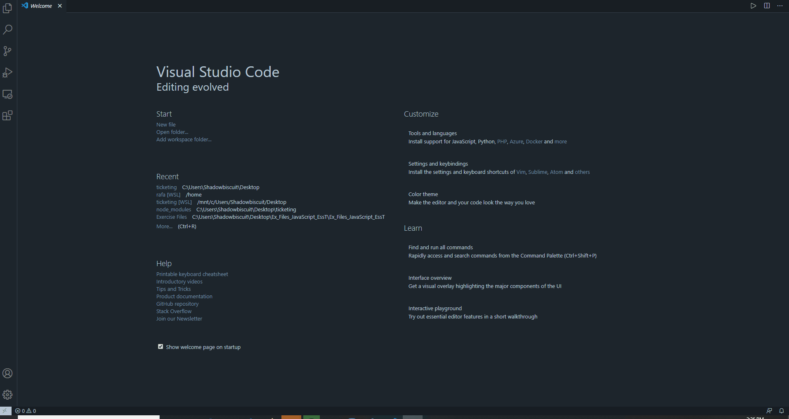

# Introduction to Lab Ticketing System

A VSCode extension providing the basic structure for a UCL Computer Science lab ticketing system. Ultimately, the ticketing system will allow students to submit help requests to a queue, allowing teaching assistants to deal with issues in a more organised and timely fashion than a traditional "hands up" method. 

This project was completed in just 2 weeks as a UCL Connected Learning Internship during summer 2020, under the supervision of Dr Ghita Kouadri Mostefaoui (UCL Department of Computer Science). It represents the start of a much larger project, to be completed by a future intern or as a finalist project. Starting with no knowledge of Javascript, I developed the following skills:

- fluency with Javascript 
- web design, including HTML, CSS formatting and JSON files
- understanding of message passing, event triggers, DOM element manipulation and data handling via forms
- ability to structure complex, multi-file coding projects logically  
- knowledge of Visual Studio Code extension development

## Feature Demonstration 


Current features: 
- **Welcome Screen**, which displays login options for: 
  1. Module Administrators 
  2. Teaching assistants 
  3. Students (unfinished)

- **Module Admin screen**, where super users may: 
  1. View the current list of module profiles, displaying the module name, code, administrators, assigned TAs, groups, request types and hours. 
  2. Remove modules from the database 
  3. Edit module names and codes by clicking on the relevant table cells 
  4. Add new modules to the database 
  5. Register new teaching assistant (TA) profiles  
  6. Table display is updated dynamically as additions/removals are made

- **TA screen**, where teaching assistants may:
  1. Login via modal pop-up using their username
  2. See a personalised list of the modules they are enrolled on  

## Installation

1. `git clone https://github.com/rafaelhuntstokes/ticketing.git` 
2. Open in VSCode 
3. Go to file *extension.js, line 24* and change `process.chdir('c:/Users/Shadowbiscuit/Desktop/ticketing');` to your current working directory. This is necessary to save module information in a file within the extension folder instead of wherever VSCode is installed 
4. Hit `F5` to launch **extension development host**
5. Open the command pallet (`control + shift + p`) and run command **Start Ticket**

## Extension Anatomy 

The extension was setup by using **Yeoman** to provide a scaffold, following [this tutorial](https://code.visualstudio.com/api/get-started/your-first-extension). To create a new extension, you need to install the following dependencies:
- [Node.js](https://nodejs.org/en/) 
- [Git](https://git-scm.com/)
- [Yeoman](https://yeoman.io/)
- [VSCode extension generator](https://www.npmjs.com/package/generator-code)

The ticketing system is implemented through the following files: 

* htmlStuff.js      : provides the HTML code for the webview and sends commands to constructors.js when buttons are clicked etc.
* constructors.js   : javascript file which contains an Object for each screen and the methods to handle events from the UI   
* extension.js      : javascript file which activates extension 
* modules.txt       : file which stores the JSON database, including the modules and TAs 

## JSON Data Structure 

The app revolves around saving and retrieving the information contained in the `modules.txt` file. JSON was chosen as the format, as it offers an intuitive object-oriented format. The basic structure consists of two objects, **modules** and **TAs**: 
```
{"modules": [], 
 "TAs"    : [] 
 }
```
Each object is a list of sub objects, i.e `"modules"` is a list of module objects with a set of attributes. For example: 
```
"aModuleName": "Introduction to Biochemistry",
"bModuleCode": "BIOL1001",
"cModuleAdmins": "Crick",
"dModuleTAs": ["Rafael", "Sajeda"],
"eModuleStudents": "200",
"fModuleReqType": "DNA . . .",
"gModuleGroups": "1",
"hModuleHrs": "500"    
```
The attributes start with a letter (a->h) to allow keys to be sorted alphabetically, which gets around the fact JSON objects are unordered. This is important when filling in the various tables to display the information. 

The `TAs` object is also a list of sub-objects, with each being a TA profile created by the **Module Admin Screen**. An example structure is: 
```
"userName": "Rafael",
"enrolled": ["Quantum", "Particle Physics"]
```
The `userName` attribute is used for the TA login verification and the `enrolled` attribute provides a link to the module objects they are enrolled to.
## Known Issues
 
- HTML file is rife with inline javascript. These functions should be refactored to a separate file and called using the `<script>` tag instead
- **Module Admin**: intermittent issue where *Add TA* button creates a form with duplicated module options  

## Suggested Future Development 

- Create online database instead of JSON textfile 
- Add superuser and module lead profiles, splitting Module Admin screen as it is now into these two user classes
- Add ability to import student and TA profiles from file, such as .csv 
- Add function to schedule module lab sessions and groups 
- Add code to manage help request queue during live lab sessions, launched from a specific TA profile 
- Create a webview page for students to submit their help requests to a specific session and mark them as complete
-----------------------------------------------------------------------------------------------------------
